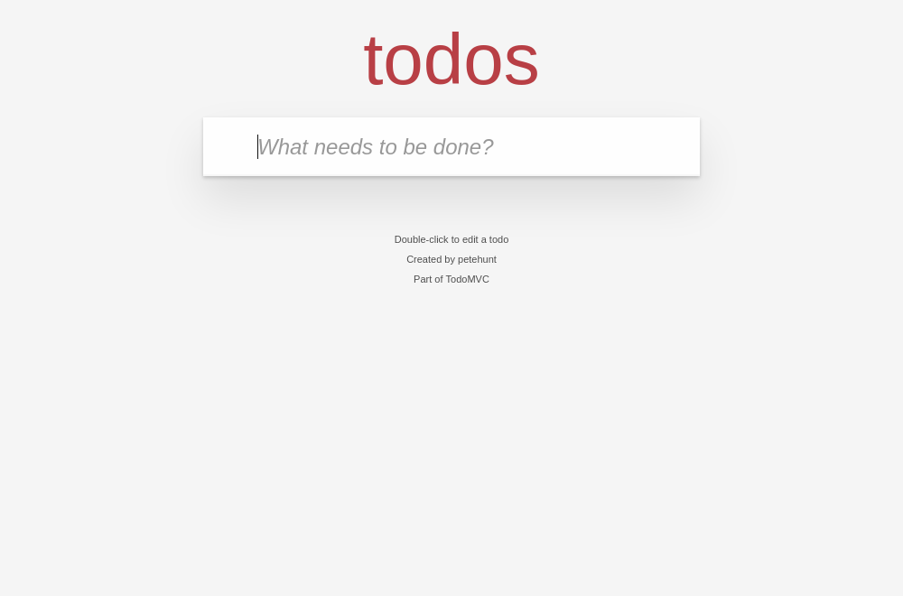
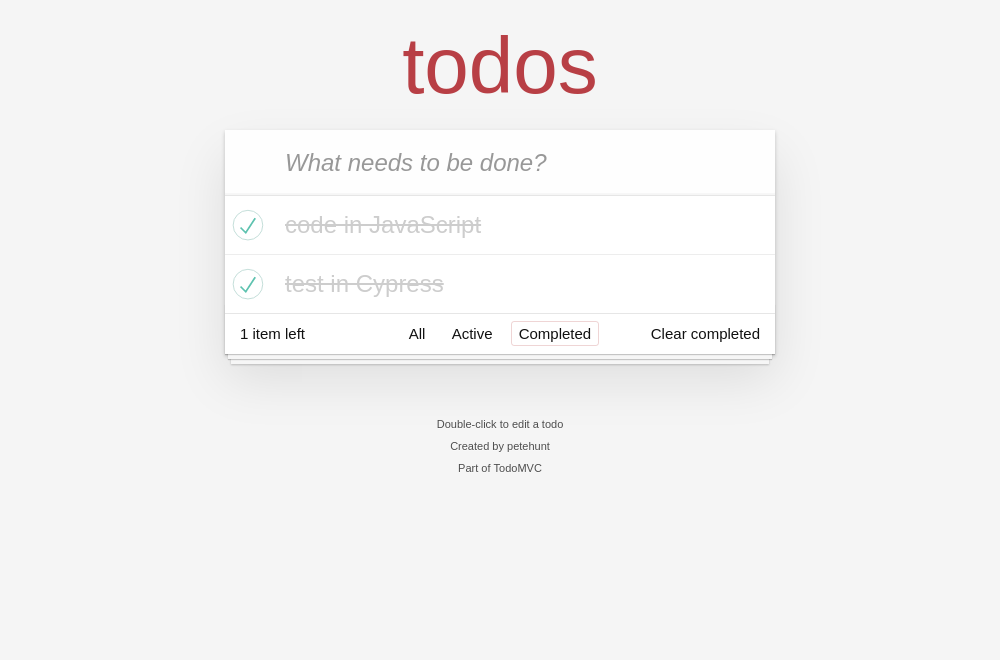
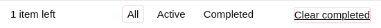
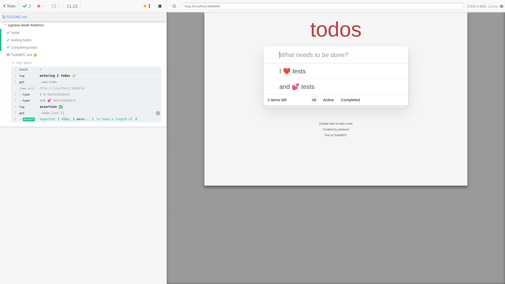

# cypress-book-todomvc

[![ci status][ci image]][ci url] [![renovate-app badge][renovate-badge]][renovate-app]

> Repo [bahmutov/cypress-book-todomvc](https://github.com/bahmutov/cypress-book-todomvc), read the blog post [Cypress Book](https://glebbahmutov.com/blog/cypress-book/). Uses [cypress-book](https://github.com/bahmutov/cypress-book) module to copy the screenshots.

## Initial screen

This application starts with an input field.



<details style="display:none">
<summary>Initial view</summary>
<!-- fiddle Initial -->

```js
cy.visit('/')
cy.get('input').should('be.visible')
cy.screenshot('initial')
```

<!-- fiddle-end -->
</details>

## Main feature

User can enter several todos, and they are added to the list


<details style="display:none">
<!-- fiddle Adding todos -->

```js
cy.visit('/')
cy.log('**entering 3 todos 📝**')
cy.get('.new-todo')
  .type('write in Markdown ⌨️{enter}')
  .type('code in JavaScript 💻{enter}')
  .type('test in Cypress 😻{enter}')
cy.log('**assertion ✅**')
cy.get('.todo-list li').should('have.length', 3)
cy.screenshot('todos')
```

<!-- fiddle-end -->
</details>

## Completing tasks

Once there are several todo items, the user can mark some items "done" and then clear them using a button.


You can see just the completed items using the filters below the list



The "Clear completed" button is at the bottom and becomes visible only if there are completed items.


Hover over the button and click on it



Only a single active todo remains


<details style="display:none">
<!-- fiddle Completing tasks -->

```js
cy.visit('/')
cy.get('.new-todo')
  .type('write in Markdown{enter}')
  .type('code in JavaScript{enter}')
  .type('test in Cypress{enter}')
cy.get('.todo-list li').should('have.length', 3)

cy.contains('.view', 'code in JavaScript').find('.toggle').click()
cy.contains('.view', 'test in Cypress').find('.toggle').click()
cy.get('.todo-list li.completed').should('have.length', 2)
cy.screenshot('completed-todos')

cy.contains('.filters li', 'Completed').click()
cy.get('.todo-list li').should('have.length', 2)
cy.screenshot('just-completed-todos')

cy.contains('.filters li', 'All').click()
cy.get('footer.footer').screenshot('footer')
cy.contains('Clear completed')
  .should('be.visible')
  .then(($el) => {
    $el.css({
      textDecoration: 'underline',
      border: '1px solid pink',
      borderRadius: '2px',
    })
  })
cy.get('footer.footer').screenshot('clear-completed')

// clear completed items and take a screenshot
// of the single active todo
cy.contains('Clear completed').click()
cy.get('.todo-list li').should('have.length', 1)
cy.screenshot('remaining-todo')
```

<!-- fiddle-end -->
</details>

## Explanation

This README file contains tests Cypress understands and runs by using [cypress-fiddle](https://github.com/cypress-io/cypress-fiddle) file preprocessor. Start the application and Cypress using

```
npm install
npm run dev
```

And click on the `README.md` file


The tests should run. These tests are above in this file, hiding inside an invisible HTML element and a comment:

```
<details style="display:none">
<!-- fiddle Initial -->
... Cypress test ...
<!-- fiddle-end -->
</details>
```

This is similar to what I have done in [Self-testing JAM pages](https://www.cypress.io/blog/2019/11/13/self-testing-jam-pages/)

The test usually includes several [.screenshot](https://on.cypress.io/screenshot) commands, these images are moved into [images](images) folder using code in the [cypress/plugins/index.js](cypress/plugins/index.js) file.

You can also take a screenshot with the test runner to show how Cypress looks during the test.



<details style="display:none">
<summary>TodoMVC test</summary>
<!-- fiddle TodoMVC test 🤯 -->

```js
cy.visit('/')
cy.log('**entering 2 todos 📝**')
cy.get('.new-todo').type('I ❤️ tests{enter}').type('and 💕 tests{enter}')
cy.log('**assertion ✅**')
cy.get('.todo-list li').should('have.length', 2)
cy.screenshot('demo-test', { capture: 'runner', log: false })
```

<!-- fiddle-end -->
</details>

For more advanced use case where you might want to generate video clips from tests, see [cypress-movie](http://github.com/bahmutov/cypress-movie)

### on CI

This project is built from repo [bahmutov/cypress-book-todomvc](https://github.com/bahmutov/cypress-book-todomvc) and tested using [GitHub Actions](https://glebbahmutov.com/blog/trying-github-actions/). If there are any changed screenshots, they are automatically committed and pushed to GH, see [.github/workflows/main.yml](https://github.com/bahmutov/cypress-book-todomvc/tree/master/.github/workflows).

**Note:** screenshots are only overwritten if they are more than 0.1% different from the existing screenshots in file byte size.

Then this README is converted into a static site using [VuePress](https://vuepress.vuejs.org/) and deployed to the GitHub Pages at [https://glebbahmutov.com/cypress-book-todomvc/](https://glebbahmutov.com/cypress-book-todomvc/).

See also [social image test](./social-image.md)

## Debugging

To see verbose messages from this project run with the environment variable

```
DEBUG=cypress-book
```

[ci image]: https://github.com/bahmutov/cypress-book-todomvc/workflows/main/badge.svg?branch=master
[ci url]: https://github.com/bahmutov/cypress-book-todomvc/actions
[renovate-badge]: https://img.shields.io/badge/renovate-app-blue.svg
[renovate-app]: https://renovateapp.com/
