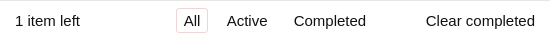

# cypress-book-todomvc

### Initial screen

This application starts with an input field.


<details style="display:none">
<!-- fiddle Initial  -->

```js
cy.visit('/')
cy.get('input').should('be.visible')
cy.screenshot('initial')
```
<!-- fiddle-end -->
</details>

### Main feature

User can enter several todos, and they are added to the list


<details style="display:none">
<!-- fiddle Adding todos  -->

```js
cy.visit('/')
cy.get('.new-todo')
  .type('write in Markdown{enter}')
  .type('code in JavaScript{enter}')
  .type('test in Cypress{enter}')
cy.get('.todo-list li').should('have.length', 3)
cy.screenshot('todos')
```
<!-- fiddle-end -->
</details>

### Completing tasks

Once there are several todo items, the user can mark some items "done" and then clear them using a button.


The "Clear completed" button is at the button and becomes visible only if there are completed items.



Hover over the button and click on it


Only a single active todo remains


<details style="display:none">
<!-- fiddle.only Completing tasks  -->

```js
cy.visit('/')
cy.get('.new-todo')
  .type('write in Markdown{enter}')
  .type('code in JavaScript{enter}')
  .type('test in Cypress{enter}')
cy.get('.todo-list li').should('have.length', 3)

cy.contains('.view', 'code in JavaScript').find('.toggle').click()
cy.contains('.view', 'test in Cypress').find('.toggle').click()
cy.get('.todo-list li.completed').should('have.length', 2)
cy.screenshot('completed-todos')

cy.get('footer.footer').screenshot('footer')
cy.contains('Clear completed').should('be.visible')
  .then($el => {
    $el.css({
      textDecoration: 'underline',
      border: '1px solid pink',
      borderRadius: '2px'
    })
  })
cy.get('footer.footer').screenshot('clear-completed').click()

cy.contains('Clear completed').should('be.visible')
  .then($el => {
    $el.css({
      textDecoration: 'none',
      border: 'none',
      borderRadius: 'none'
    })
  })
cy.get('.todo-list li').should('have.length', 1)
cy.screenshot('remaining-todo')
```
<!-- fiddle-end -->
</details>

## Explanation
