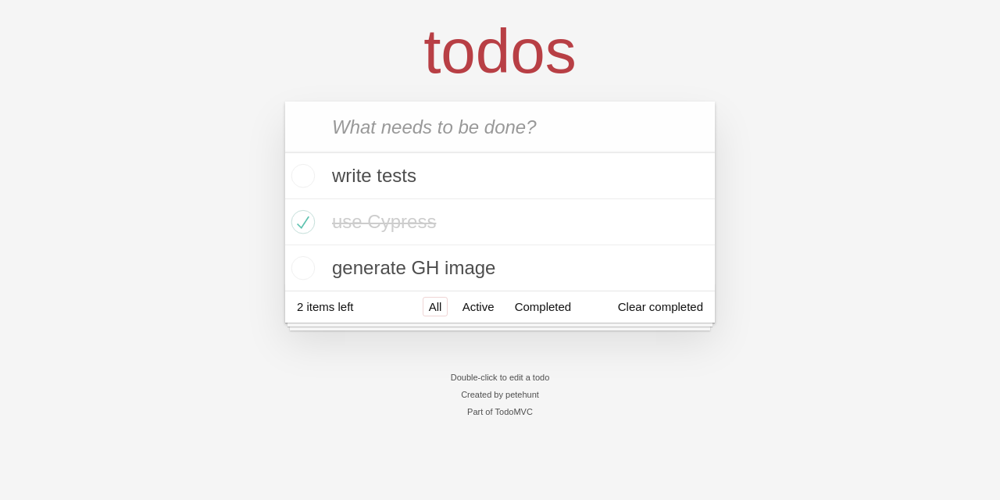

This file is meant to run as a Cypress test and generate social image for GitHub repository. See issue [#4](https://github.com/bahmutov/cypress-book-todomvc/issues/4)

<!-- fiddle Social image -->

```js
cy.viewport(1280, 640) // best for social image
cy.visit('/')
cy.get('.new-todo')
  .type('write tests{enter}')
  .type('use Cypress{enter}')
  .type('generate GH image{enter}')
cy.get('.todo-list li').should('have.length', 3).eq(1).find('.toggle').click()
cy.screenshot('social-image')
```

<!-- fiddle-end -->

The result image is 1280x640 pixels


